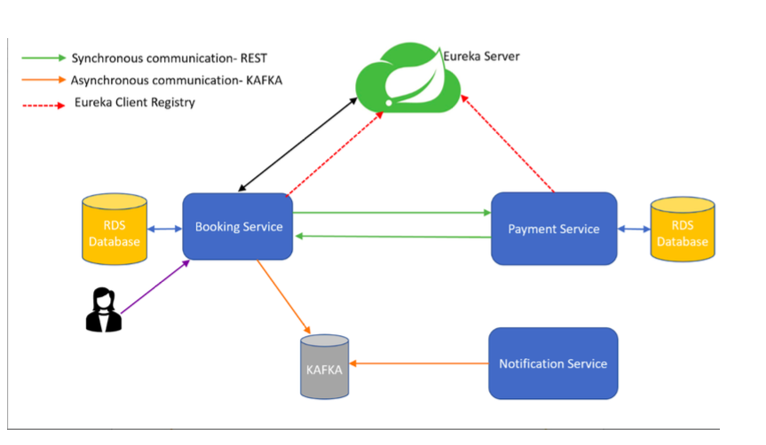

# Sweet-home
> Hotel room booking application
## Tech Stack used

* ***Spring Boot***
    * Booking microservice
    * payment microservice
    * notification microservice
    * eureka service discovery
* ***KAFKA***
* ***SQL DATABASE***
* ***AWS SERVICES***
    * EC2 instance service
        * for running Docker and Docker compose
        * for running KAFKA service
    * RDS Service for running SQL
---

## Architecture

### more details at
[CodeLogic.pdf](./CodeLogic.pdf)